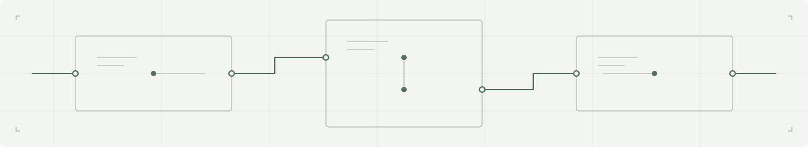

<picture>
  <source media="(prefers-color-scheme: dark)" srcset="images/systems-dark.svg">
  <source media="(prefers-color-scheme: light)" srcset="images/systems-light.svg">
  
</picture>

# Zeeshan Qaswar

**Senior / Lead Unity Engineer** 
Multiplayer · Performance · Production Systems

**I build and stabilize complex Unity systems** across games and real-time applications. With 7+ years of professional Unity development, my work spans multiplayer integration, production architecture, performance and memory optimization, mobile engineering, and hands-on technical leadership.

**[Portfolio ↗︎](https://zeeshanqaswar.com/) · [Engineering Case Studies ↗︎](https://zeeshanqaswar.com/#case-studies) · [LinkedIn ↗︎](https://www.linkedin.com/in/zeeshanqaswar/)**

## Engineering Focus

**Multiplayer Systems** 
Photon Fusion, Photon PUN2, host/client architecture, authority models, replicated state, networked gameplay, and host migration.

**Performance & Memory** 
Unity Profiler, memory diagnosis, Addressables, asset lifecycle, progressive loading, UI optimization, and mobile constraints across iOS and Android.

**Production Architecture** 
C#, modular systems, MVP-style UI architecture, interfaces, services, dependency injection, and production integrations with PlayFab and Firebase.

**Technical Ownership** 
Hands-on technical leadership, code review, mentoring, cross-team collaboration, debugging, and production delivery.

## Open-Source Engineering

### [Poly Vault ↗︎](https://github.com/xeeshanqaswar/Poly-Vault)

> **An asset library with a direct path into Unity.**
>
> An offline-first desktop application for organizing 2D and 3D asset libraries, with searchable asset management and an integrated import workflow for Unity 6.
>
> Electron · Node.js · Unity 6
>
> **[Explore the source ↗︎](https://github.com/xeeshanqaswar/Poly-Vault#readme)**

## Selected Production Engineering

Commercial and research work, documented through engineering case studies.

### SPACE
**Research Platform Architecture & Performance**

Led Unity engineering for an iPad-based spatial assessment platform, including complex research authoring tools, localization, production architecture, and memory/performance optimization.

[Read the case study ↗︎](https://zeeshanqaswar.com/case-studies/space/)

### G.I. Joe: Wrath of Cobra
**Multiplayer Integration**

Led a two-developer multiplayer adaptation of an existing action game using Photon Fusion, covering authority-based gameplay, tick-based input, networked state, spawning, and host migration.

[Read the case study ↗︎](https://zeeshanqaswar.com/case-studies/gi-joe-multiplayer/)

### Pro Golf
**Personalization & Asset Lifecycle**

Architected a Unity personalization system involving API-driven inventory, Addressables, progressive content loading, navigation-aware asset management, and memory optimization.

[Read the case study ↗︎](https://zeeshanqaswar.com/case-studies/pro-golf-personalisation/)

## Engineering Direction

I'm continuing to deepen my understanding of C#/.NET internals, backend systems, real-time networking fundamentals, concurrency, and automated testing—building on production Unity engineering experience.

## Contact

Interested in discussing Unity architecture, multiplayer integration, performance optimization, or complex production engineering?

**[Website](https://zeeshanqaswar.com/) · [LinkedIn](https://www.linkedin.com/in/zeeshanqaswar/) · [Email](mailto:xeeshanqaswar@gmail.com)**
